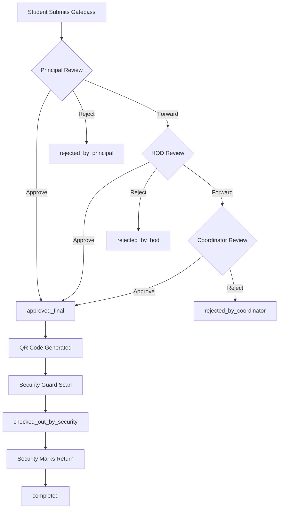

# DwarPal System - Complete Developer & AI Context Guide

This document provides a comprehensive technical overview of **DwarPal**, a digital gatepass, faculty leave, and visitor access management system designed for educational institutions. It serves as a context source for developers and AI assistants to understand the codebase structure, database schemas, workflows, and business logic.

---

## 1. System Overview

DwarPal is a full-stack web application that digitizes college gate operations. It replaces paper-based gatepasses with a digital validation system that coordinates actions between Students, Faculty, Department Heads (HODs), College Administration (CAO), the Principal, the Chairman, and Security guards.

### Core Portals & User Roles
1. **Student Portal**: Submit gatepass requests, track live approval status, view history, and present approved QR codes at the gate.
2. **Faculty Portal**: Submit faculty gatepasses/leave requests, review student gatepass requests (as coordinators), and check approval status.
3. **HOD (Head of Department) Portal**: Review escalated/forwarded student gatepasses for their department and approve faculty workload substitutions.
4. **Principal Portal**: Oversee campus access, review student requests, or forward them down to HODs/coordinators.
5. **CAO (Chief Administrative Officer) Portal**: Review faculty gatepass and leave requests.
6. **Chairman Portal**: Review high-level campus data and approve critical escalated requests.
7. **Security / Campus Security (Bouncer)**: Scan QR codes, verify gatepass details, check-out/check-in users, and verify visitor access.
8. **Admin / IT Admin Portal**: Manage users, seed accounts, modify departments, configure permissions, and monitor audit logs.
9. **Owner**: Full system override, billing, configuration settings, and analytical reports.

---

## 2. Technical Stack

*   **Frontend**: React (v18), Vite, Tailwind CSS, Lucide React (Icons), and React Router DOM.
*   **Backend**: Node.js, Express, Socket.io (real-time events), Cookie-Parser.
*   **Database**: MongoDB with Mongoose (ODM). Supports MongoDB-Memory-Server for localized tests and development.
*   **Email Services**: Nodemailer (Gmail/SMTP support) and Resend API, with terminal console fallback in development.
*   **Integrations**:
    *   **LLM Integration** (Gemini / OpenAI API) for high-throughput, structured AI evaluation of visitor entries.
    *   **Redis** (optional) for caching visitor validations; falls back to an in-memory TTL Map.
    *   **Firebase / Web Push** (optional) for push notifications.

---

## 3. Directory Structure

```
DwarPal_Project/
├── src/                      # FRONTEND CODEBASE
│   ├── components/           # UI Components
│   │   ├── auth/             # Login/Register components
│   │   ├── ui/               # Layout & reusable UI widgets
│   │   ├── AccessPortal.jsx  # Security gate landing page
│   │   ├── AdminPortal.jsx   # Admin panel (user creation, logs)
│   │   ├── StudentManagementPanel.jsx # Admin management screen
│   │   ├── SecurityVerificationPanel.jsx # Gate guard control panel
│   │   └── FacultyLeaveWizard.jsx # Multi-step leave form
│   │   └── ...
│   ├── hooks/                # React custom hooks
│   ├── config/               # Frontend configs
│   ├── App.jsx               # App routing, Auth state, Screen layout
│   ├── App.css               # Global application stylesheet
│   ├── index.css             # Tailwind imports & CSS tokens
│   ├── mockData.js           # Shared lists, role metadata & schemas
│   └── main.jsx              # Vite react entry point
│
├── backend/                  # BACKEND CODEBASE
│   ├── src/
│   │   ├── config/           # db.js connection, env.js parser
│   │   ├── constants/        # appConstants.js (roles, statuses)
│   │   ├── controllers/      # Route controllers (auth, gatepass, visitor)
│   │   ├── middleware/       # Auth guard, security headers, rate limits
│   │   ├── models/           # Mongoose schemas (User, Gatepass, AuditLog)
│   │   ├── routes/           # Express router endpoints
│   │   ├── services/         # Email delivery, web push configurations
│   │   ├── utils/            # Helper scripts (QR signing, custom errors)
│   │   ├── validators/       # Express-validator arrays
│   │   ├── app.js            # Express app assembly & middleware
│   │   └── server.js         # HTTP and WebSockets startup listener
│   └── package.json          # Node dependencies
```

---

## 4. Key Workflows & Lifecycles

### A. Student Gatepass Lifecycle
A student gatepass goes through multiple stages before they can exit the campus:



#### Status Transitions (`STUDENT_GATEPASS_STATUSES`):
*   `pending_principal` (Default state upon student submission)
*   `forwarded_to_hod` (Escalated by Principal)
*   `forwarded_to_coordinator` (Escalated by HOD)
*   `forwarded_to_campus_security` / `forwarded_to_chairman` (Alternative escalations)
*   `approved_final` (Approved by Principal, HOD, or Coordinator; ready for security scan)
*   `checked_out_by_security` (Marked OUT by security)
*   `completed` (Marked IN by security)
*   `cancelled` (Withdrawn by Student)
*   `rejected_by_*` (Rejected by the respective authority)

---

### B. Faculty Gatepass Lifecycle
Faculty gatepasses are reviewed directly by the CAO:
*   **Statuses**: `pending_cao` $\rightarrow$ `approved_by_cao` or `rejected_by_cao` $\rightarrow$ `checked_out_by_security` $\rightarrow$ `completed`.

---

### C. Faculty Leave Requests
A complex multi-step workload substitution workflow:
1.  **Workload Swap**: Faculty member submits a request, identifying other faculty members to cover their classes.
2.  **Workload Status**: Stays `pending_hod` until the HOD approves the workload substitutions (`approved_by_hod`).
3.  **Authority Approval**: Short Leaves go to the Principal or CAO for approval. Long Leaves require multi-level approval before marking overall status as `approved` or `rejected`.

---

### D. Visitor Access & AI Verification
DwarPal features an AI-driven high-throughput visitor check-in system:
1.  **Entry Request**: Security inputs visitor name, type, host name, purpose, check-in time, and permitted hours.
2.  **SSE Streaming**: The `/api/visitor/verify` endpoint uses a Keep-Alive connection pool and Server-Sent Events to stream the AI response.
3.  **AI Engine**: Calls Gemini (or OpenAI) using a strict system prompt targeting raw minified JSON:
    ```json
    { "auth": "OK|NO|HOLD", "msg": "reason", "ts": "timestamp" }
    ```
4.  **Caching**: Hashes the payload using MD5 as a lookup key in Redis (or falls back to an in-memory TTL map) to bypass LLM calls for repeated visitor profiles.

---

## 5. Database Schemas (`backend/src/models/`)

### 1. User (`User.js`)
Stores authentication, credential data, profile, and authorization levels.
*   **Key Fields**:
    *   `email`: String (unique, indexed, required)
    *   `password`: Hashed String (hashed via bcrypt)
    *   `role`: Enum (`student`, `faculty`, `hod`, `cao`, `principal`, `security`, `admin`, `it`, `chairman`, `campus_security`)
    *   `enrollmentNo` / `employeeId`: String (unique identifier)
    *   `isEmailVerified`: Boolean (restricts action access)
    *   `isOtpEnabled`: Boolean (login 2FA for privileged roles: `owner`, `admin`, `principal`, `hod`)

### 2. Gatepass (`Gatepass.js`)
Tracks the gatepass request detail, approval actions, and checkout timestamps.
*   **Key Fields**:
    *   `gatepassId`: String (Unique generated sequence, e.g., `GP-2026-XXXXX`)
    *   `user`: Ref to `User`
    *   `reason`: String
    *   `status`: Enum of `GATEPASS_STATUSES`
    *   `checkOutTime` / `checkInTime`: Date (set by security)
    *   `approvalActions`: Array of `{ level, status, actionBy, actedAt, comment }`
    *   `qrSignature`: HMAC signature to prevent QR code tampering at the gate

### 3. FacultyLeaveRequest (`FacultyLeaveRequest.js`)
Manages multi-day faculty leaves and lecture arrangements.
*   **Key Fields**:
    *   `workloadStatus`: Enum (`pending_hod`, `approved_by_hod`, `rejected_by_hod`)
    *   `overallStatus`: Enum (`pending`, `approved`, `rejected`)
    *   `leaveType`: Enum (e.g. `Casual Leave`, `Short Leave`, `On Duty`)
    *   `workloadArrangements`: Array of `{ date, timeSlot, classId, substituteFacultyId, status }`

### 4. PendingRegistration (`PendingRegistration.js`)
Stores registration details temporarily before email verification is complete.
*   **Key Fields**:
    *   `email`: String (indexed)
    *   `verificationCode`: 6-digit OTP string
    *   `expiresAt`: Date (Default: 10 minutes TTL)
    *   `attempts`: Number (Max 5 attempts allowed)

---

## 6. Authentication & Security Flow

```
   [Register Form] ──> Save to PendingRegistration ──> Send 6-digit OTP
                                                             │
   [Login Screen] <── Redirect after Verification <── Verify OTP Code
         │
    Verify Credentials & privileged-role OTP
         │
         └──> Issue HTTP-Only Cookie ("dwarpal_token")
```

### Authorization Rules
*   **Student Account Creation**: Students **cannot** register themselves. To maintain institutional integrity, student accounts must be created by an Admin/IT Admin via the Admin Dashboard.
*   **Staff Registration**: Faculty, HOD, Principal, and Security can register directly on the platform but require validation policies.
*   **API Protection**: All routes under `/api/` (except public ones) are guarded by `protect` and `requireVerifiedEmail` middleware.
*   **Role Guard**: The `authorize(...roles)` middleware restricts controller actions to specific user roles.
*   **QR Tamper Protection**: The QR code is a signed JWT or HMAC containing the `gatepassId` and signed with `QR_SIGN_SECRET`. Security scanning decodes and verifies the signature to prevent fake bypasses.

---

## 7. Email Delivery Setup

The backend email system resolves delivery using a priority hierarchy:
1.  **Gmail SMTP** (Recommended): Active when `SMTP_HOST` is `smtp.gmail.com` and credentials are provided. Requires a Google account with 2-Step Verification and a generated **App Password**.
2.  **Generic SMTP**: Active when `SMTP_HOST`, `SMTP_USER`, and `SMTP_PASS` are provided.
3.  **Resend API**: Active if `RESEND_API_KEY` and `EMAIL_FROM` are set.
4.  **Console Fallback**: Development mode fallback. Prints emails (including OTP codes) directly to the terminal console. Blocked in production (`NODE_ENV=production`).

---

## 8. Development & Environment Configurations

### `.env` File Reference
Ensure these variables are correctly configured in `backend/.env` for testing:

```env
NODE_ENV=development
PORT=5000
MONGO_URI=mongodb://127.0.0.1:27017/dwarpal
ENABLE_IN_MEMORY_DB=false
AUTO_SEED_DEMO_ACCOUNTS=true

JWT_SECRET=replace_with_a_long_random_secret
QR_SIGN_SECRET=replace_with_a_long_random_qr_signing_secret
COOKIE_NAME=dwarpal_token

# Email Delivery Configuration
EMAIL_DELIVERY_MODE=auto      # options: auto, SMTP, resend, console
EMAIL_FROM=your-email@gmail.com
SMTP_HOST=smtp.gmail.com
SMTP_PORT=587
SMTP_SECURE=false
SMTP_USER=your-email@gmail.com
SMTP_PASS=xxxx xxxx xxxx xxxx # 16-character Google App Password

# LLM Configurations for Visitor Verification
LLM_PROVIDER=gemini           # options: gemini, openai
GEMINI_API_KEY=your_gemini_key
OPENAI_API_KEY=your_openai_key
```

### Seeding Accounts
Run the following script to create default demo accounts across all roles:
```bash
cd backend
npm run seed:admins
```

### Starting the Project
To run DwarPal locally:
```bash
# Terminal 1: Backend Server (runs on Port 5000)
cd backend
npm install
npm run dev

# Terminal 2: Frontend Client (runs on Port 5173)
npm install
npm run dev
```
